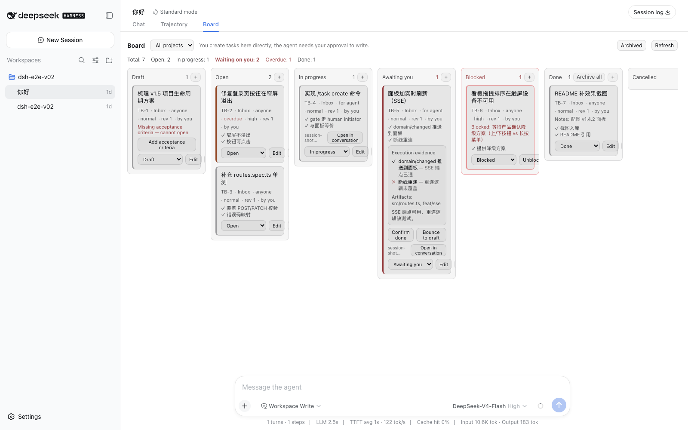
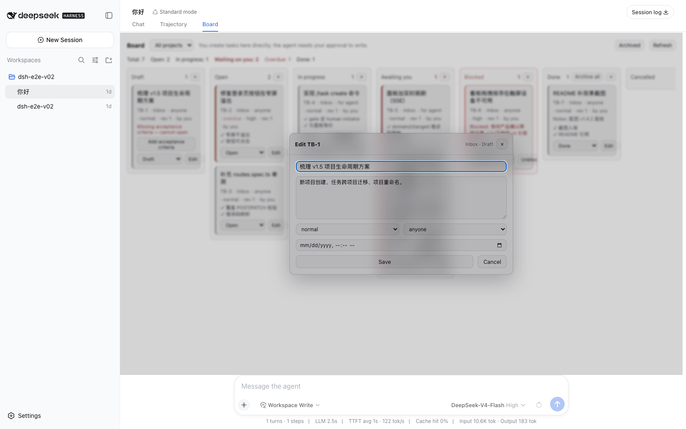
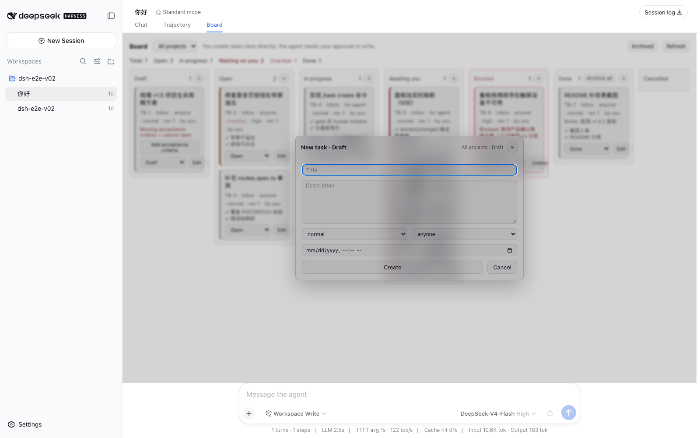

# dsh-taskboard

A cross-session, workspace-scoped task board for [DeepSeek Harness](https://github.com/deepseek-ai/deepseek-harness).

Built as a **complete capability seam** — `ctx.taskboard` service + storage-domain
provider + model tools + `/task` commands + a JSON API + a board panel — not as a
bag of tools.

## Screenshots (效果截图)

The board panel (任务板) — glance-stats line, project dropdown, ball-to-human
highlighting, per-column counts, execution evidence, blocked reasons, and the
one-click actions (归档 / 解除阻碍 / 归档全部):



Create and edit share **one centered modal** — the same fields, create starts
empty, edit loads the card (title, description, priority, executor, deadline):

 · 

## Why this exists next to `todo_write`

dsh already ships session-scoped work tracking. This plugin does not replace it:

| | Scope | Survives session end | Who writes |
| --- | --- | --- | --- |
| `todo_write` (built in) | one session | no | the model, freely |
| `ctx.goals` (built in) | one session | no | requires human root authority |
| **`dsh-taskboard`** | **across sessions and workspaces** | **yes** | **you directly; the model needs your approval** |

Use `todo_write` for "the steps of this task". Use the board for "the work this
project still owes", carried between sessions and picked up by whichever session
claims it.

## Install

```sh
dsh plugin --profile web add @navidid/dsh-taskboard
dsh --profile web --dump-config   # a "# == @navidid/dsh-taskboard" layer appears
dsh web
```

## Support boundary: the web-app bundle is required

The board persists through `ctx.storageDomain` and serves its API through
`ctx.webServer` — both mounted by the shipped `web` profile, neither by
`headless`.

**Installing this into a headless profile fails the boot, loudly:**

```
Error: dsh: plugin tree failed to load: dsh: 3 entries did not activate
@navidid/dsh-taskboard: pending (waiting for service: storageDomain)
@navidid/dsh-taskboard/tool: pending (waiting for service: taskboard)
@navidid/dsh-taskboard/routes: pending (waiting for service: webServer)
```

That is dsh working as designed — a row that never activates is a
misconfiguration, not a benign no-op, so it stops startup instead of leaving you
with a half-mounted plugin.

For a headless board, mount the storage rows yourself and switch the routes row
off:

```yaml
# headless-taskboard.yml, used as: dsh --profile headless --patch ./headless-taskboard.yml "…"
- id: taskboard-routes
  disabled: true

- insert:
    - id: storage
      name: '@deepseek-ai/dsh-storage'
    - id: storage-json
      name: '@deepseek-ai/dsh-storage-json'
      config:
        root: !!js dshHomePath('storages')
    - id: storage-domain
      name: '@deepseek-ai/dsh-storage-domain'
      config:
        backend: json
```

Because the medium is home-level, a headless run and the web UI then share one
board.

## Quick start (5 minutes)

After `dsh web` is running, open any session — the board is the third view tab
(任务板), and the agent has the `task_*` tools. A task's full life:

1. **Create it.** Click the `+` on any column in the panel, or tell the agent
   `create a task on the task board titled "…"` (the agent calls `task_create`).
   Without acceptance criteria the task lands in 待立项 (`draft`).
2. **Spec it.** A task is only claimable when it has at least one
   `acceptance_criteria`. Add them in the panel's API, or tell the agent
   `update task TB-1: set acceptance_criteria to ["…"]` — then move it to
   `open` (等待认领).
3. **Claim it.** With auto-claim enabled (below), an idle agent picks it up
   automatically; otherwise ask the agent `claim task TB-1`.
4. **Confirm it.** When the work settles, the task lands in 等你确认
   (`awaiting_human`) with execution evidence (per-criterion ✓/✗). Review the
   evidence, then 确认完成 (→ `done`) or 打回待立项 (→ `draft`).

That is the whole loop: **you define and confirm, the agent executes and
reports.**

## Model-facing tools

| Tool | Effect |
| --- | --- |
| `task_projects` | List projects, to obtain a `project_id` — the only discovery path on an empty board |
| `task_list` | Read the board, optionally filtered by column or project |
| `task_create` | Add a task, optionally straight into a column **(approval-gated)** |
| `task_update` | Move a task between columns or edit it **(approval-gated)** |
| `task_claim` | Claim a task for this session and move it to `in_progress` **(approval-gated)** |
| `task_block` | Report a task as blocked, with the reason **(approval-gated)** |

Tasks are referenced by their short key (`TB-1`) everywhere — every `id`
parameter accepts the key or the full id, and the model only ever sees the key.
`task_update` and `task_claim` accept `expected_revision`. A caller that passes
the revision it last read loses to any write that landed meanwhile
(`revision-conflict`) instead of silently clobbering it. This is what makes
parallel sessions on one board safe.

### Tool parameters

| Parameter | Tools | Meaning |
| --- | --- | --- |
| `acceptance_criteria` | `create`, `update` | Checkable success conditions; the gate to `open` |
| `context_refs` | `create`, `update` | Files/commits/issues the executor should read (soft hint) |
| `definition_of_done` | `create`, `update` | Optional closing conditions |
| `depends_on` | `create`, `update` | Prerequisite task ids/keys; claimable only when each is `done`/`cancelled` |
| `budget_tokens` | `create`, `update` | Output-token cap for the executing subagent; `null` clears |
| `context_budget_tokens` | `create`, `update` | Input-context cap for the dispatched subagent (v1.2); a dispatch whose estimated prompt overflows it is refused and the task settles `blocked`; `null` clears |
| `executor` | `create`, `update` | `agent` / `human` / `any` (default). `human` tasks are never auto-claimed |
| `due_at` | `create`, `update` | Planned deadline (epoch ms); auto-claim prefers earlier |
| `note` / `notes` | `update` / `create` | Process note — `note` appends, never overwrites |
| `priority` | `create` | `low` / `normal` / `high` / `urgent` (default `normal`); feeds auto-claim's weighted pick |
| `status` | `create`, `update` | Board column (default `draft` unless criteria are given) |
| `expected_revision` | `update`, `claim` | Optimistic-concurrency guard |
| `reason` | `block` | Why the agent is stuck; required |

## The status machine

Columns describe **whose turn it is**, not how far the work progressed — the
board is organised around the ball, because that is what drives notifications,
highlighting, and (v0.3) auto-claim:

| Status | Meaning | Ball is with |
| --- | --- | --- |
| `draft` | 待立项 — not defined yet | human |
| `open` | 等待认领 — defined, claimable | agent (claimable) |
| `in_progress` | 处理中 — on an agent's hands | agent |
| `awaiting_human` | 等你确认 — back with the human | human |
| `blocked` | 遇到阻碍 — agent stuck, needs a human | human (exception) |
| `done` | 完成 | — |
| `cancelled` | 取消 | — |

Moving into `blocked` requires a reason (use `task_block`); leaving `blocked`
clears it. Blocking is an agent's report — the panel does not offer it as a
move target; a human unblocks with the card's 解除阻碍 button (v1.3) or by
moving the card anywhere else.

## Task specs (v0.5)

A task is only *claimable* when its **spec is complete** — at least one
acceptance criterion. This is the gate between `draft` and `open`: a task
without criteria stays in 待立项 (`draft`), and the panel says what is missing.
The agent's `task_create` / `task_update` accept:

| Field | Meaning |
| --- | --- |
| `acceptance_criteria` | Checkable success conditions (the gate; the executing subagent verifies each) |
| `context_refs` | Files / commits / issues the executor should read (soft hint) |
| `definition_of_done` | Optional closing conditions text |

Creating a task without `acceptance_criteria` lands it in `draft` rather than
failing; complete the spec (via `task_update` or the API) and move it to
`open` to make it claimable.

## Execution evidence (v0.6)

When a claimed task settles, the executing subagent reports **structured
evidence**: a per-criterion self-assessment (`met` + note), produced artifacts,
and a summary. The task lands in 等你确认 (`awaiting_human`) carrying that
evidence; the panel shows it (✓/✗ per criterion) with two actions:

- **确认完成** — move to `done` (the human confirms the outcome)
- **打回待立项** — bounce to `draft` (the work needs to be redone)

A subagent that finishes without a valid structured report settles as
`blocked` — the board never stores half-evidence. The self-assessment is an
accelerator for your review, not a replacement for it.

## Dependencies and scheduling (v0.7)

A task can declare prerequisites (`depends_on` in the tools, or `dependsOn`
via the API): it is claimable only when every dependency is 已完成 (`done`) or
已取消 (`cancelled`). Auto-claim picks the highest-priority ready task (urgent →
low, then oldest first). A missing dependency parks the task in not-ready — the
panel shows it, and clearing the reference unblocks it. Cycles are rejected.

Per-task `budget_tokens` caps the executing subagent's output; a child that
blows the budget lands the task in 遇到阻碍 (`blocked`) with a budget-overrun
reason.

## Experience feeds the next task (v0.8)

Completed tasks with evidence become **experience cards**. Two places reuse
them:

- **Create**: `task_create`'s result lists up to three related completed tasks
  ("Related experience"), so the model can reuse what a previous execution
  learned instead of exploring from scratch.
- **Session start** (opt-in): set `sessionContext: true` on the auto-claim row
  to inject a digest of open work + related experience into a new session's
  first turn. Bounded by `sessionContextLimit` (default 5 each).

The history of the board is deliberately live: a done task's evidence is the
next task's context.

## Executor, deadlines, and notes (v0.9)

- **`executor`**: mark a task `human` (needs a person — decisions, reviews),
  `agent`, or `any` (default). **`human` tasks are never auto-claimed** — they
  stay in 等待认领 for a person to pick up.
- **`due_at`**: a planned deadline (epoch ms). Auto-claim prefers earlier
  deadlines; the panel flags overdue tasks. It is a commitment signal, not an
  estimate — no scheduling math.
- **`note` / `notes`**: append process notes (`note` on `task_update` appends,
  never overwrites, and records a `noted` activity entry). The card shows the
  latest notes.

## Stop-loss: cancel, timeout, visibility, bounce reasons (v1.1)

- **Cancel.** A dispatched task runs in an independent subagent; if a human
  moves it out of `in_progress` (takeover, cancellation), the child is stopped
  instead of burning tokens. A late child result never overwrites a task the
  human already moved.
- **Timeout.** `dispatchTimeoutMs` (default 30 min) on the auto-claim row
  disposes an over-running child and settles the task 遇到阻碍 (`blocked`)
  with a timeout reason.
- **Visibility.** While a task is dispatched, the card shows 执行中 with the
  subagent id and elapsed minutes.
- **Bounce reasons.** 打回待立项 now asks why — the reason lands in the task
  notes and the activity stream, so the next executor knows what to change.

## Governance: archive, ball-to-human highlight, context budget (v1.2)

- **Archive.** A done card gets an **归档** button. Archiving is a soft
  archive — `archivedAt` is stamped, the task leaves the active board, but it
  is never deleted: `GET /api/taskboard/board?archived=true` and the export
  still see it, and the same write with `archived: false` restores it. Only
  `done` tasks can be archived.
- **Ball-to-human highlight.** The two columns that wait on YOU —
  `awaiting_human` and `blocked` — count in warning colour and bold, and cards
  waiting on a human get the warning accent. Within a column, overdue cards
  float to the top.
- **Context budget.** `context_budget_tokens` caps the subagent's INPUT
  context (`budget_tokens` caps its output). When the auto-claim driver
  estimates that the dispatch prompt would overflow the budget
  (`ceil(chars / 4)` — a deliberately strict ceiling), it refuses **before
  starting the child** and settles the task 遇到阻碍 (`blocked`) with the
  estimate in the diagnosis. A giant task is recognized as undispatchable
  instead of launched into a truncated context.

## Cross-process safety and panel experience (v1.3)

- **Cross-process write safety.** Two processes sharing one `$DSH_HOME` (a GUI
  plus a headless run) used to silently overwrite each other — the JSON backend
  rewrites the whole file per write. Since v1.3 every write first compares the
  storage file against the process's snapshot; if another process rewrote it,
  the write is refused with **409 `concurrent-modification`** — "refresh and
  retry" — instead of losing data. The guard is scoped to the JSON backend
  (the shipped default); other backends are untouched.
- **Archive view.** The header's **只看归档** toggle shows the archive; every
  archived card gets **恢复** — 归档 is now a round-trip, not a one-way door.
- **Card editing.** 编辑 on any card opens an inline editor for title,
  description, priority, executor, and deadline — saved with the read revision,
  so a racing change is a 409, not a clobber.
- **One-click unblock.** A blocked card gets **解除阻碍** (back to 等待认领).
- **Archive all done.** The done column's **归档全部** button sweeps the whole
  column (`POST /api/taskboard/archive-done`), with a two-step confirm.

## Board usability: project focus, glance stats, manual order (v1.4)

- **Project focus.** The header dropdown filters the board to one project
  (`/board?project=<id>`) — it composes with the archive view.
- **Glance stats.** A line under the header shows total, open, in-progress,
  **等你** (awaiting_human + blocked, warning colour), overdue, and done —
  all derived from the loaded board.
- **Drag to reorder.** Cards in the **全部项目** view are draggable: drop one
  between others and the column's order is pinned (`POST
  /api/taskboard/reorder`, whole-column). Overdue cards still float to the top
  as a render hint; the manual order is the storage fact underneath.

## Board statistics, cost, and human-to-agent notes (v1.5)

- **Board statistics.** The 统计 button opens a stats panel — everything
  derived from the activity stream, no extra instrumentation:
  - **Ratios**: completion, rework (bounces / done), agent success (settles
    that landed 等你确认 vs 遇到阻碍), overdue rate.
  - **Averages**: lead time (created → done), cycle time (in_progress dwell),
    awaiting-you time, blocked time — per-status dwell reconstructed from the
    activity timeline.
  - **Trend**: a 7-day throughput mini-chart (created vs completed per day).
  - **Stuck**: tasks waiting past their threshold (in_progress 120 min,
    awaiting_human 1440, blocked 720 — `statsStuckMinutes`), plus the five
    oldest unfinished tasks.
  - **Cost**: actual tokens used by dispatched subagents (see below).
  Also served as `GET /api/taskboard/stats`.
- **Actual token usage.** The driver measures the dispatched child's session
  at settle (`tokensUsed`; falls back to the prompt estimate when the child is
  already disposed) — the first number that is a spend, not a cap. Until a
  task has a measurement, the stats cost row shows nothing.
- **Notes reach the agent.** A bounce reason or steering note in `notes` is now
  quoted into the dispatch prompt — the executing agent finally sees the
  human's instruction (bounces carry `bounce: …` automatically).

## Automatic claiming (v0.3)

The board can hand work to an idle agent by itself — bound to **token quota**,
not to a timer: when an agent session goes idle, the auto-claim driver claims
the oldest unclaimed task in `open` **only if**
`contextWindow − currentContextTokens ≥ minRemainingTokens`, then wakes the
agent with a follow-up turn telling it what it claimed. A nearly full context
gets no new work; a context of unknown capacity gets no new work either.

It is **off by default**: the bundle's `taskboard-autoclaim` row ships
`disabled: true`, so installing or upgrading never surprises anyone. Enable it
in your overlay:

```yaml
# $DSH_HOME/cordis.patch.yml — the row's whole config is replaced, so restate
# every key you want to keep.
- id: taskboard-autoclaim
  disabled: false
  config:
    minRemainingTokens: 8000
```

| Key | Default | Meaning |
| --- | --- | --- |
| `minRemainingTokens` | `8000` | Floor on `contextWindow − totalTokens` before the driver will claim |
| `subagentProvider` | `spawn` | Provider name for the dispatched child session |
| `dispatchTimeoutMs` | `1800000` | (v1.1) Dispose an over-running child and settle the task `blocked` |
| `sessionContext` | `false` | (v0.8) Inject a digest of open work + related experience into a new session's first turn |
| `sessionContextLimit` | `5` | (v0.8) Bound on the digest's open-tasks and experience cards each |

Two notes. The claim itself is a system write and skips the approval prompt
(it is the deployment's configured automation, not the model asking) —
everything the agent does *after* the claim still passes the normal gate.

Since v0.4 the driver also **scopes to workspaces** and **hands the task to a
background subagent**:

- **Workspace scoping.** When the session's working directory belongs to a
  registered workspace, only tasks of that workspace (plus unbound
  board-global tasks) are claimable — an idle session never picks up another
  workspace's work. Without a resolvable workspace the scan stays whole-board.
- **Subagent execution.** A claimed task is dispatched to a background
  subagent (an independent child session) that runs it and reports back; the
  task then moves to **等你确认 (`awaiting_human`)** on success, or **遇到阻碍
  (`blocked`)** with the reason on failure. The claiming session only claims
  and monitors — it is free to keep working. If the subagent seam is
  unavailable the driver falls back to handing the task to the claiming
  session directly.

## Workspaces

Tasks can be bound to a workspace (a project directory). Binding is automatic
from v0.4: a task created or claimed by a session is bound to the workspace
owning that session's working directory, when one is registered; an explicit
workspace always wins and a bound task is never rebound. The panel shows the
workspace name on bound cards. Unbound tasks are board-global and claimable
from any workspace. (Workspace *management* — creating, renaming, reordering —
is the host's own workspace UI, not this plugin's.)

## Commands

```
/task list               # all tasks
/task list open          # one column (draft | open | in_progress | awaiting_human | blocked | done | cancelled)
/task show TB-1          # one task, by key or id
/task export             # backup document to stdout
```

Commands are read-only in this version. They dispatch without spending a model
turn. (Human-initiated command writes are possible now that the gate keys on the
initiator rather than the surface — they just are not built yet.)

## The board panel

Open any session and the board is the third view tab, beside 对话 and 轨迹.
Seven columns, one card per task, a priority accent, labels, and per-column
counts. The `blocked` column and its cards are warning-tinted and show the
blocking reason; since v1.2 the two columns waiting on you (`awaiting_human`
and `blocked`) count in warning colour, cards waiting on a human wear the
warning accent, and overdue cards float to the top of their column. Later
iterations added the header's project dropdown and glance-stats line (v1.4),
drag-to-reorder in the 全部项目 view (v1.4), the 只看归档 toggle and card
editing (v1.3), and the 解除阻碍 / 归档 / 归档全部 one-click actions
(v1.2–v1.3).

**You create and move tasks here directly** — no approval prompt, because you
are the one asking. Each column has its own `+` that creates straight into that
column. The agent's `task_*` tools still need your approval. Each card records
which of you made it (`你创建` / `agent 创建`).

A card opens an **activity drawer**: who (you or the agent) did what and when,
newest first. A claimed task shows its session and an **「在对话中打开」** button
that switches the conversation to that session — no page reload.

The panel ships no stylesheet — it colours itself with `color-mix` over
`currentColor` and inherits the shell's theme.

## Short ids

Every task carries a human-readable key — `TB-1`, `TB-2`, … — unique board-wide,
never reused after deletion. Say it out loud, paste it into a commit message,
reference it in any tool call. The prefix is `Config.keyPrefix` (default `TB`).
v0.1 boards are backfilled once at the first mount, in creation order, with no
further action.

## HTTP API

| Method | Path | Effect |
| --- | --- | --- |
| GET | `/api/taskboard/board?status=…&archived=true&project=<id>` | Read the board (filter by status / archive / project) |
| GET | `/api/taskboard/task/<id\|key>` | Read one task |
| GET | `/api/taskboard/task/<id\|key>/activity` | One task's activity stream, newest first |
| GET | `/api/taskboard/export` | Backup document (includes archived) |
| POST | `/api/taskboard/task` | Create (human-initiated, no approval) |
| PATCH | `/api/taskboard/task/<id\|key>` | Update; send `expectedRevision` to refuse a stale write |
| PATCH | `/api/taskboard/task/<id\|key>` | Archive/restore: send `{ "archived": true\|false }` (v1.2) |
| POST | `/api/taskboard/archive-done` | Sweep the whole done column; returns `{ "archived": n }` (v1.3) |
| POST | `/api/taskboard/reorder` | Pin a column's order: `{ "refs": [<id\|key>…] }` — the column's FULL list (v1.4) |

Create/update also accept `context_budget_tokens` (input-context cap for the
dispatched subagent; `null` clears it) since v1.2.

Registered on the host's existing web server; no new port. **Writes require
`content-type: application/json`** — see [SECURITY.md](SECURITY.md) for why.

## Configuration

```yaml
# $DSH_HOME/cordis.patch.yml — a config patch replaces the whole `config`, so
# restate every key you want to keep. (The loader's patch entry is the flat
# `{ id, config }` form — no `replace:` wrapper.)
- id: taskboard
  config:
    writePolicy: ask        # ask | auto | off
    maxTasks: 2000
    listLimit: 50
    defaultProjectName: Inbox
    keyPrefix: TB
    activityRetentionPerTask: 50
```

| Key | Default | Meaning |
| --- | --- | --- |
| `writePolicy` | `ask` | `ask` routes every write to `ctx.approval`; `auto` writes unattended; `off` makes the board read-only |
| `maxTasks` | `2000` | Ceiling on stored tasks |
| `listLimit` | `50` | Default page size for `task_list` |
| `defaultProjectName` | `Inbox` | Project seeded when the board opens empty |
| `keyPrefix` | `TB` | Short-id prefix; keys look like `TB-1` |
| `activityRetentionPerTask` | `50` | Activity entries kept per task before the oldest are trimmed |

### Scaling past a few hundred tasks

The `web` profile routes storage domains to the JSON backend, which **rewrites
the whole unit file on every write** — deliberately, because legibility is that
backend's reason to exist. For a large board, route this domain to SQLite:

```yaml
- insert:
    - id: storage-sqlite
      name: '@deepseek-ai/dsh-storage-sqlite'
- id: storage-domain
  config:
    backend: json
    routes:
      taskboard: sqlite
```

## Where the board data lives

The board persists through `ctx.storageDomain`, which routes to a backend under
your dsh home. With the shipped `web` profile (JSON backend) the board is one
file:

```
$DSH_HOME/storages/taskboard.json      # $DSH_HOME defaults to ~/.dsh
```

The file holds the unit header (`name` + `version`), the `global` slot (the
short-id counter), and the `tables` — `tasks`, `projects`, and `activity`.
The JSON backend rewrites the whole file atomically on every write (legible by
design); for a large board, route the domain to SQLite instead (see "Scaling
past a few hundred tasks").

**Upgrades migrate in place, automatically.** v0.2 normalized stored statuses
and backfilled `key`s, and the newer tables/global slot materialize on first
mount — you do not export and re-import to upgrade. What you DO need is a
backup before upgrading, because the storage layer never migrates *backward*:
a board written by a newer version may not parse in an older one. See the next
section.

**Your data never ships with the plugin.** The board file lives in your dsh
home; the npm package contains only code and docs.

## Backup, and why it ships in v1

The storage layer has **no migration path**: a medium stamped with a different
domain version rejects at open. `/task export` and `GET /api/taskboard/export`
produce a `dsh-taskboard-export-v1` document, and `ctx.taskboard.importDocument`
reads it back.

> **Upgrading? Export first.** The storage layer never migrates: v0.2
> normalized stored statuses and backfilled keys, and a board written by a
> newer version may not parse in an older one. Run `/task export` (or the
> export route) before upgrading, so you can restore if you need to go back.

## Common questions

**Why is my task stuck in 待立项 (draft)?** It has no acceptance criteria —
the gate to `open`. Add at least one (`task_update` with
`acceptance_criteria`, or the API), then move it to `open`.

**Why didn't the agent pick up my task?** Either auto-claim is off (it is by
default — see below), the task has no criteria (still `draft`), a dependency
is unfinished, or the task is `executor: human`. Ask the agent to `claim` it
explicitly, or enable auto-claim.

**Why is my task in 遇到阻碍 (blocked)?** The executing agent reported it
stuck (`task_block`), the subagent failed, or it blew its `budget_tokens`.
The card shows the reason and any diagnosis.

**How do I enable auto-claim?** Un-disable the `taskboard-autoclaim` row in
your overlay (see "Automatic claiming") — and remember it only claims tasks
that are `open`, spec-complete, dependency-ready, and not `executor: human`.

**Can the model write without asking?** Only if you set `writePolicy: auto`
in the `taskboard` config. Default `ask` routes every model write through
approval; `off` makes the board read-only.

## Compatibility

Peers are pinned to an exact dsh release (`0.1.0-rc.6`). dsh is pre-release and
ships breaking changes; a dsh upgrade may need a matching plugin upgrade.

> **npm dist-tag warning.** Every `@deepseek-ai/dsh-*` library package currently
> has `latest` pointing at an old `0.0.1-rc.1` while the real build is on the
> `next` tag. Always install those packages by exact version, never by `latest`.

## Development

```sh
pnpm install
pnpm run check    # typecheck + tests
pnpm run build    # tsdown bundles lib/, tsc emits lib/types/
```

End-to-end against a throwaway dsh home, so your real profile is untouched:

```sh
export DSH_HOME=/tmp/dsh-taskboard-check
pnpm run build
dsh plugin --profile web add .          # requires pnpm on PATH
dsh --profile web --dump-config | grep -A6 '@navidid/dsh-taskboard'
dsh web --port 3099 &
curl -s http://127.0.0.1:3099/api/taskboard/board
```

A typechecking build can still fail to boot — Cordis resolves services at
runtime — so run this before publishing.

The repo also ships **real end-to-end runners** (`tests/e2e/*.mjs`) that boot a
throwaway dsh home with the plugin linked, drive a real model round, and assert
the full chain (create → auto-claim → dispatch → evidence → confirm), plus
route-level checks per version. They run against the npx checkout's packages:

```sh
DSH_HOME=/tmp/dsh-taskboard-check \
E2E_DSH_PACKAGE=<npx checkout>/@deepseek-ai/dsh \
E2E_APP_BOOT_PACKAGE=<npx checkout>/@deepseek-ai/dsh-app-boot \
node tests/e2e/v14-http.mjs
```

Unit tests (`pnpm run check`) cover the same contracts in-memory; the runners
prove the process really boots and serves.

Every version shipped with an implementation plan — the why, the design, the
acceptance criteria, and the risk table that guided it. They are archived,
one per version, under [`docs/plans/`](docs/plans/); the distilled decisions
live in [ARCHITECTURE.md](ARCHITECTURE.md).

## Security

See [SECURITY.md](SECURITY.md) — it states exactly what this plugin can do on
your machine, and what the approval gate does and does not cover.

## License

[MIT](LICENSE)
